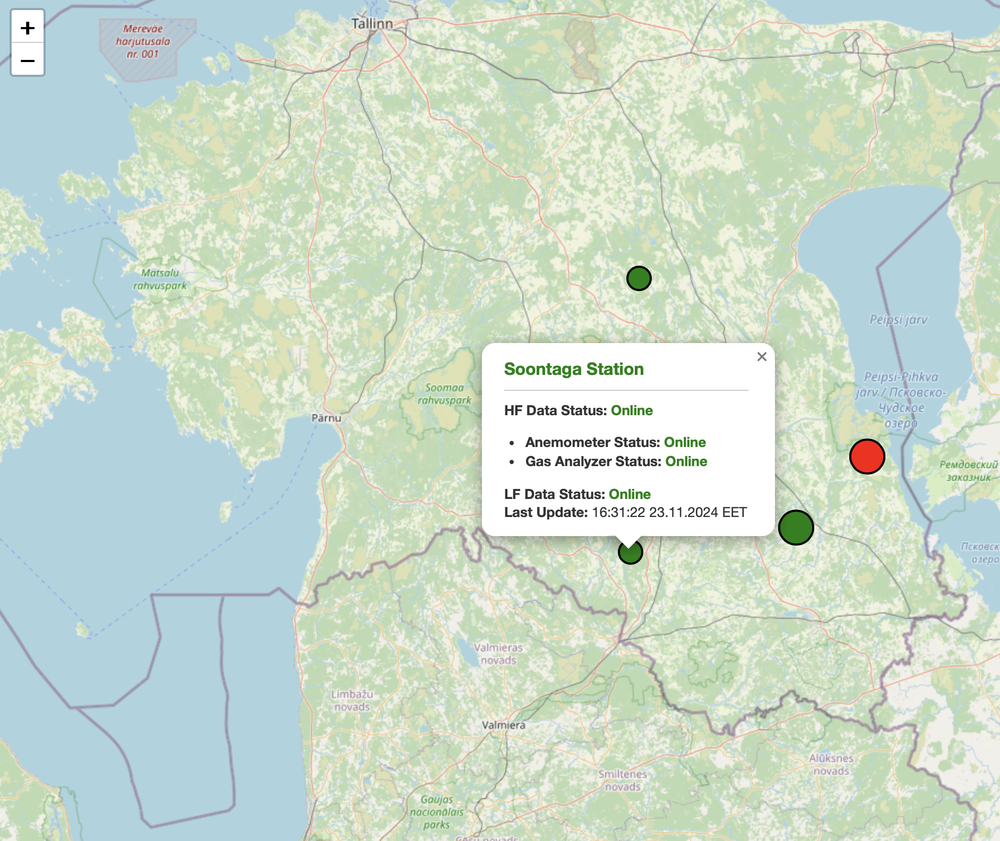

# Interactive Map for Eddy Covariance Stations with Data Flow Monitoring Status

## Overview

This application provides an **interactive map** that displays Eddy Covariance monitoring stations. 
It visualizes **the status of data flow** (High-Frequency and Low-Frequency data) for each station, helping scientists and technicians monitor their operational state with **minimal delay**. 

> **Note**: This application is **specifically** made for **internal use** within Tartu University's **local network** and is **protected by a VPN**.

This repository includes:
- A **backend API** for retrieving EC stations data and calculating their statuses.
- A **frontend** that visualizes stations on an interactive map with markers that **update every minute**.
- **Configuration files** for database and table integration.

## Features

### Backend API
- Built using **Flask** and **Waitress**.
- Connects to SQL Server via **pyodbc**.
- Calculates statuses (HF and LF data), detects violations, and returns results in JSON format.

### Frontend
- Interactive map using **Leaflet.js**.
- Displays stations as **color-coded** markers:
- Clustered markers for better usability.

### Configuration
- YAML-based file (`config.yaml`) for:
  - Database connection.
  - Table and column mapping for station data.

## Result:
Below is an example of the interactive map with operational statuses:

- Green markers indicate fully operational stations.
- Gold markers indicate warnings in data flow.
- Red markers indicate offline stations.

## Workflow overview:
For a more detailed explanation of each workflow step, visit the [wiki](https://github.com/Svyatoslav-stack/Interactive-Stations-Status-Map/wiki).

## Contact 
Feel free to contact me via email at svyatoslav.rogozin@gmail.com or svatoslav.rogozin@ut.ee.
