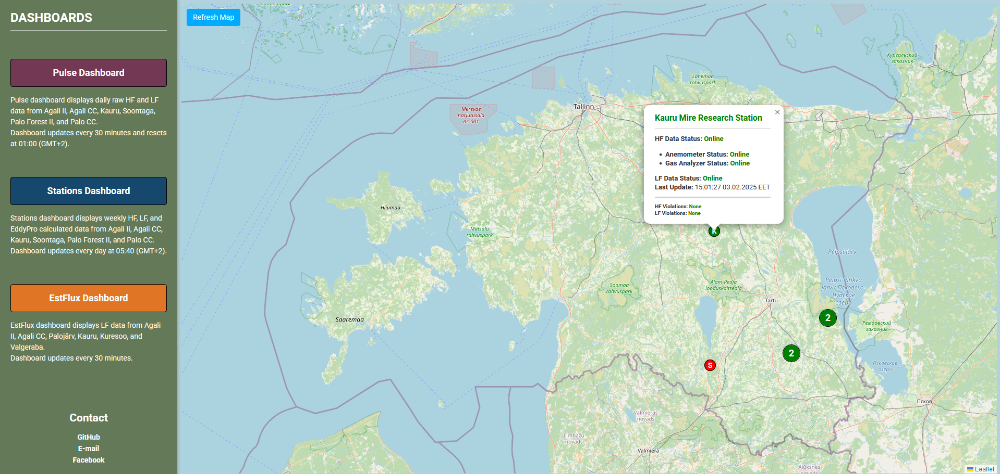

# Interactive Map for Eddy Covariance Stations with Data Flow Monitoring Status  

## Overview  

This application provides an **interactive map** for displaying Eddy Covariance (EC) monitoring stations. It visualizes the **data flow status** (both High-Frequency and Low-Frequency data) of each station, enabling scientists and technicians to monitor their operational states with a **minimal delay of just 1 minute**.  

> **Note**: This application is designed exclusively for **internal use** within Tartu University's **local network** and is secured with **VPN access**.  

---

## Features  

- **Backend API** (`station_status_app.py`) to retrieve EC station data and calculate operational statuses.  
- **Frontend visualization** (`index.html` in the `templates` folder), which displays an interactive map with markers that **refresh every minute**.  
- **Configuration flexibility**: A `config.yaml` file provides an example of SQL configuration setup.  
- A convenient **startup script** (`start_station_status_app.bat`) for launching the application.  

---

## Result  

The application generates an interactive map where stations are represented by color-coded markers:  
- **Green markers**: Stations are fully operational.  
- **Red markers**: Stations require attention.  

  

---

## Workflow Overview  

For a detailed explanation of the workflow and additional setup instructions, refer to the [wiki](https://github.com/Svyatoslav-stack/Interactive-Stations-Status-Map/wiki).  

---

## Contact  

For any questions or assistance, feel free to reach out via email:  
- **Primary email**: svatoslav.rogozin@ut.ee  
- **Alternative email**: svyatoslav.rogozin@gmail.com  
